# Table des Matières

1.  [**_Généralité_**](#Généralité)
2.  [**_Technique_**](#Technique)

    - **Partie 1 : Docker 🐋**

      2.1. [**_Exercice 1 : Une application statique dockerisée_**](#Exercice-1)

    1. [**_Pré-requis_**](#Pré-requis)
    2. [**_Créer une application web statique simple_**](#Créer)
    3. [**_Rédiger un Dockerfile pour cette application_**](#Rédiger)
    4. [**_Construire l'image Docker à partir du Dockerfile_**](#Construire)
    5. [**_Démarrer un conteneur Docker basé sur cette image pour tester localement_**](#Démarrer)

    2.2. [**_Exercice 2 : Docker Multistage Build_**](#Exercice-2)

    1. [**_Pré-requis_**](#Pré-requis)
    2. [**_Ecrire un Dockerfile multistage pour l'application construite dans l'exercice 1_**](#Ecrire)
    3. [**_Construire l'image Docker à partir du Dockerfile_**](#Rédiger)
    4. [**_Démarrer un conteneur Docker basé sur cette image Multi-stage pour tester localement_**](#Démarrer)

    2.3. [**_Exercice 3: Traefik & Docker Compose_**](#Exercice-3)

    1. [**_Pré-requis_**](#Pré-requis)
    2. [**_Ecrire le fichier Docker Compose qui lance Traefik et qui donne accès à votre site web_**](#Dcoker-compose)
    3. [**_Pertinence des choix faits pour Traefik_**](#Rédiger)

    - **Partie 2: GitLab CI/CD 🦊**

      2.1. [**_Exercice 1 : Intégration et Déploiement Continu avec AutoDevOps_**](#Intégration)

    1. [**_Pré-requis_**](#Pré-requis)
    2. [**_Configurer un repository Gitlab avec AutoDevOps_**](#Configurer)
    3. [**_Personnaliser le .gitlab-ci.yml pour l'application web statique_**](#Personnaliser)
    4. [**_Déployer l'application dans un environnement de staging_**](#Déployer)
    5. [**_Documenter le processus AutoDevOps et les choix de configuration_**](#Documenter)

    2.2. [**_Exercice 2 : Déploiement en Staging et Production_**](#Exercice-2)

    1. [**_Pré-requis_**](#Pré-requis)
    2. [**_Compléter le .gitlab-ci.yml pour inclure des stages de déploiement distincts pour le staging et la production_**](#Compléter)
    3. [**_Configurer le déploiement automatique sur GitLab Pages pour la production_**](#Ecrire)
    4. [**_Vérifier le fonctionnement de l'application dans les deux environnements_**](#Rédiger)
    5. [**_Documenter les étapes et configurations pour les déploiements en staging et en production_**](#Démarrer)

    2.3. [**_Exercice 3 : Vulnérabilités_**](#Exercice-3)

    1. [**_Pré-requis_**](#Pré-requis)
    2. [**_A l'aide des conteneurs Docker fournis par Owasp ZAP, mettre en place un scanner de vulnérabilité sur votre site web_**](#Owasp-ZAP)
    3. [**_Récupérer les résultats dans les artifacts_**](#Récupérer)
    4. [**_Utiliser les artifacts dans un job suivant pour bloquer la CI si des vulnérabilités sont détectées_**](#Utiliser)

<br>

# 1 - Généralité

Cette documentation technique vise à fournir une perspective détaillée sur les aspects techniques du projet en réponse à l'énoncé. Vous y trouverez une présentation succincte du projet, de ses objectifs, ainsi que des éléments clés relatifs à son développement et à son déploiement.

Vous trouverez l'énoncé dans le fichier [PROJET.md](https://gitlab.com/Lthat_h/projet_docker_gitlab_ci_cd_new/-/blob/main/PROJET.md?ref_type=heads)

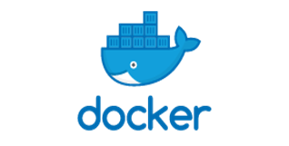 

**Bonne Lecture !**

# 2 - Technique

## **------------------------------- Partie 1 : Docker 🐋 --------------------------------------**

## 2.1 --- Exercice 1: Une application statique dockerisée

### 2.1.1 ------ Pré-requis

                        - Docker doit être installé
                        - Editeur de code (Vscode, SublimText, Notepad++)

### 2.1.2 ------ Créer une application web statique simple

**Résumé :**

Cette application web statique dédiée aux voitures a été construite en utilisant vite et React comme framework principal pour faciliter le processus de build. Le choix de **Vite + React** offre une structure optimale et une gestion efficace des pages, tout en restant orienté vers un rendu côté client. Le design est élaboré en CSS avec **Tailwind CSS**, garantissant une présentation visuelle attrayante.

**Technologies Utilisées**

                        - Framework   :   React
                        - Langages    :   HTML, CSS, JS
                        - Design      :   Tailwind CSS

### 2.1.3 ------ Rédiger un Dockerfile pour cette application

La rédaction d’un Dockerfile simplifie le processus de déploiement, assure la portabilité de l’application, renforce la sécurité et facilite la collaboration au sein de l’équipe de développement. C’est une pratique recommandée dans le développement moderne d’applications.

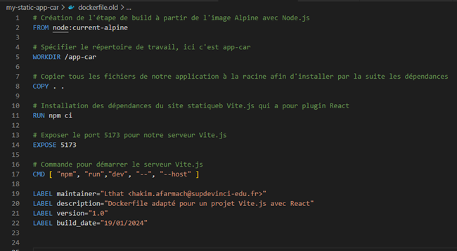

<br>

**Labels**

Les étiquettes à la fin du fichier Docker permettent de fournir des métadonnées sur l'image Docker. Elles incluent des informations telles que le mainteneur, la description, la version et la date de construction. Ces informations peuvent être utiles pour documenter et suivre l'image.

### 2.1.4 ------ Construire l'image Docker à partir du Dockerfile

Pour Construire l’image Docker à partir du Dockerfile ci-dessus il faut d’abord se placer à la racine du projet là où se trouve le Dockerfile, ensuite taper :

**docker build -t app-car:1.0 .**

                        - Docker build ==> Commande pour construire l'image
                        - -t ==> Tag, option qui permet de spécifier le nom de l'image
                        - App-car:1.0 ==> Nom de l'image avec la version
                        - . ==> Chemin vers le dossier contenant le Dockerfile (racine)

### 2.1.5 ------ Démarrer un conteneur Docker basé sur cette image pour tester localement

Pour tester l’application localement nous pouvons exécuter un conteneur avec l’image créée précédemment.

**docker run -d -p 5173:5173 --name app-car-dev app-car:1.0**

                        - Docker run ==> Commande pour démarrer un conteneur
                        - -d ==> Mode détaché, exécution du conteneur en arrière plan
                        - -p ==> mapping de port, 5173 (droite conteneur) au 5173 ( gauche hôte )
                        - --name ==> Nom du conteneur
                        - App-car:1.0 ==> Image qu'on utilise

Pour avoir une partie de son contenu modifiable nous pouvons exécuter le conteneur Docker à partir d’un volume :

**docker run -d -p 5173:5173 --name app-car-dev -v $(pwd)/src/components:/app-car/src/components app-car:1.0**

                        - v ==> Option pour spécifier le mappage de volume entre un répertoire sur notre machine hôte et un répertoire dans le conteneur Docker.

Ici le contenu modifiable sera toutes la partie **components** de mon application (Footer, navbar, etc…)

## 2.2 --- Exercice 2: Docker Multistage Build

### 2.2.1 ------ Pré-requis

                        - Docker doit être installé
                        - Editeur de code (Vscode, SublimText, Notepad++)
                        - Avoir fini l'exercice 1

### 2.2.2 ------ Ecrire un Dockerfile multistage pour l'application construite dans l'exercice 1

L’intérêt de rédiger un Dockerfile multistage est principalement pour optimiser la taille de l’image docker en utilisant plusieurs étapes (stages). La finalité consiste à conserver que les fichiers nécessaires à l’exécution dans l’image finale, ce qui réduit également les attaques potentielles de l’application.

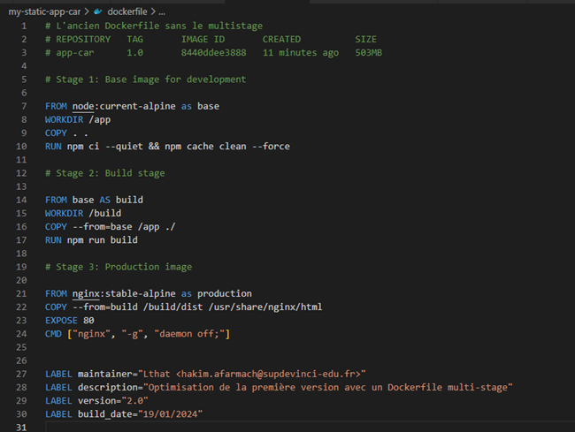

<br>

**Stage 1: Base image for development**

Le premier stage crée une image de base pour le développement Node.js, installe les dépendances, et prépare l'environnement de travail pour le build ultérieur de l'application.

- **FROM node:current-alpine as base** ==> Utilise l'image officielle de Node.js avec l'étiquette "current-alpine" comme base pour ce stage, et le nomme "base".

- **WORKDIR /app** ==> Définit le répertoire de travail à "/app" dans l'image

- **COPY . .** ==> Copie tous les fichiers à la racine du projet dont l'application dans le répertoire de travail de l'image.

- **RUN npm ci --quiet && npm cache clean --force** ==> Installe les dépendances du projet avec npm. Les commandes npm ci installent les dépendances de manière plus efficace que npm install, et npm cache clean --force supprime le cache npm pour réduire la taille de l'image.

<br>

**Stage 2: Build stage**

Le deuxième stage effectue le build de l'application en utilisant l'image de base créée dans le premier stage, générant ainsi les fichiers nécessaires pour le déploiement.

- **FROM base AS build** ==> Utilise l'image créée dans le premier stage ("base") comme base pour ce stage, et le nomme "build".

- **WORKDIR /build** ==> Change le répertoire de travail à "/build" dans l'image.

- **COPY --from=base /app ./** ==> Copie les fichiers du répertoire de travail du stage précédent (base) dans le répertoire de travail de ce stage.

- **RUN npm run build** ==> Exécute la commande "npm run build", qui est généralement utilisée pour construire l'application ( création, des fichiers statiques ).

<br>

**Stage 3: Production image**

Le troisième stage crée une image légère et optimisée pour la production en utilisant l'image Nginx comme base, puis copie les fichiers construits lors du deuxième stage pour être servis par Nginx.

- **FROM nginx:stable-alpine as production** ==> Utilise l'image officielle Nginx avec l'étiquette "stable-alpine" comme base pour ce stage, et le nomme "production".

- **COPY --from=build /build/dist /usr/share/nginx/html** ==> Copie les fichiers générés lors de l'étape de construction (dans le répertoire "/build/dist") vers le répertoire d'accueil de Nginx.

- **EXPOSE 80** ==> Indique que le conteneur écoute sur le port 80.

- **CMD ["nginx", "-g", "daemon off;"]** ==> Définit la commande par défaut pour le conteneur. Dans ce cas, il lance Nginx en mode démon.

<br>

### 2.2.3 ------ Construire l'image Docker à partir du Dockerfile

Pour Construire l’image Docker à partir du Dockerfile ci-dessus il faut d’abord se placer à la racine du projet là où se trouve le Dockerfile, ensuite taper :

**docker build -t app-car:2.0 -f Dockerfile .**

                        - Docker build ==> Commande pour construire l'image
                        - -t ==> Tag, option qui permet de spécifier le nom de l'image
                        - App-car:2.0 ==> Nom de l'image avec la version
                        - -f ==> --file permet de spécifier le chemin vers le fichier Dockerfile
                        - . ==> Chemin vers le dossier contenant le Dockerfile (racine)

### 2.2.4 ------ Démarrer un conteneur Docker basé sur cette image Multi-stage pour tester localement

Pour tester l’application localement nous pouvons exécuter un conteneur avec l’image créée précédemment.

**docker run -d -p 8080:80 --name app-car-prod app-car:2.0**

                        - Docker run ==> Commande pour démarrer un conteneur
                        - -d ==> Mode détaché, exécution du conteneur en arrière plan
                        - -p ==> mapping de port, 8080 (droite conteneur) au 80 ( gauche hôte )
                        - --name ==> Nom du conteneur
                        - App-car:2.0 ==> Image qu'on utilise construit par le Dockerfile Multi-stage

Résultat ci-dessous :

<br>

 

<br>

## 2.3 --- Exercice 3: Traefik & Docker Compose

### 2.3.1 ------ Pré-requis

                        - Docker doit être installé
                        - Editeur de code (Vscode, SublimText, Notepad++)
                        - Avoir fini l'exercice 1 & 2

### 2.3.2 ------ Ecrire le fichier Docker Compose qui lance Traefik et qui donne accès à votre site web.

Le fichier Docker Compose que nous crééons dans cette exercice configure deux services, Traefik et l'application "app-car", avec une dépendance entre eux, et utilise des labels pour permettre à Traefik de router le trafic vers l'application correctement. Le tout est orchestré avec Docker Compose pour simplifier le déploiement et la gestion des conteneurs.

Traefik agit en tant que reverse proxy pour diriger le trafic entrant vers différents services (load balancing), simplifiant ainsi la gestion des connexions réseau, offrant une couche d'abstraction.

**Voici l'archi utilisé :**

<br>

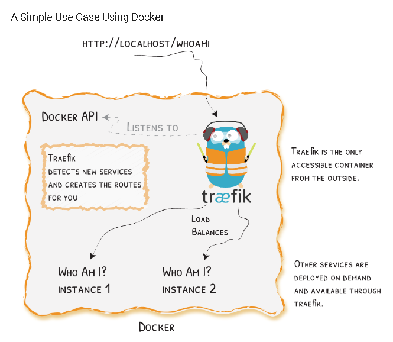

<br>

**Voici mon Docker compose avec les commentaires :**

<br>

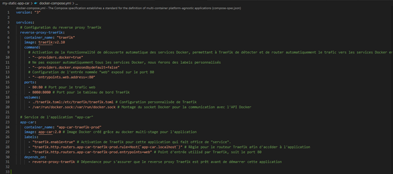

<br>

**Voici mon fichier de conf Traefik en .toml**

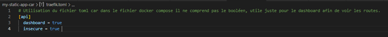

### 2.3.3 ------ Pertinence des choix faits pour Traefik .

- **Découverte automatique des services Docker** ==> l'utilisation de _providers.docker=true_ dans la configuration de Traefik active la fonction de découverte automatique des services Docker. Cela permet à Traefik de détecter automatiquement les services en cours d'exécution dans l'environnement Docker, simplifiant ainsi la configuration.

- **Exposition sélective des services Docker** ==> En utilisant _--providers.docker.exposedbydefault=false_, Traefik ne configure pas automatiquement l'exposition de tous les services Docker, ce qui permet un contrôle plus fin sur les services qui sont accessibles via Traefik.

- **Configuration personnalisée via un fichier traefik.toml** ==> La configuration personnalisée de Traefik est externalisée dans un fichier traefik.toml. Cela permet de définir des configurations avancées spécifiques à Traefik sans avoir à modifier directement le fichier Docker Compose, améliorant ainsi la modularité et la lisibilité du code. Ce fichier est facultatif est juste utilisé pour le dashboard car dans le fichier docker_compose j'ai eu quelques problèmes.

- **Utilisation d'étiquettes (labels) pour la configuration** ==> Les étiquettes dans la configuration de l'application **_app-car_** permettent de définir des règles spécifiques pour Traefik, comme l'activation de Traefik pour l'application, la définition de la règle de routage en fonction du nom de domaine, et la spécification du point d'entrée utilisé par Traefik. Ci_dessous les labels que j'ai utilisé et leurs explications :

  - **traefik.enable=true** ==> Cette étiquette active Traefik pour l'application "app-car". Elle indique à Traefik de prendre en charge le routage et la gestion du trafic pour cette application.

  - **traefik.http.routers.app-car-traefik-prod.rule=Host('app-car.localhost')** ==> Cette étiquette définit la règle de routage pour l'application. Elle indique à Traefik de router le trafic destiné à l'application "app-car" basée sur le nom de domaine "app-car.localhost". Cela signifie que lorsque Traefik reçoit une requête avec ce nom de domaine, il dirigera cette requête vers le service "app-car".

  - **traefik.http.routers.app-car-traefik-prod.entrypoints=web** ==> Cette étiquette spécifie le point d'entrée utilisé par Traefik pour router le trafic vers l'application. Dans ce cas, le point d'entrée est défini comme "web", qui correspond au port 80.

  - **Dépendance explicite sur le service Traefik** ==> En spécifiant
    **_depends_on_** pour le service "app-car", le Docker Compose assure que le service "app-car" ne sera lancé que lorsque le service Traefik sera prêt. Cela garantit que Traefik est opérationnel avant que l'application ne démarre, assurant ainsi que le routage via Traefik fonctionne correctement.

**En résumé, ces choix fournissent une configuration claire, flexible et adaptée aux besoins spécifiques de l'architecture, en permettant une gestion efficace des services via Traefik dans un environnement Docker.**

Il suffit juste de tapé dans le terminal à la racine du projet où il y a le Docker compose.yml **_docker compose up -d_** pour exécuter les services. Et bien sûr avoir effectué l'exercice 2 pour avoir l'image de l'application.

**Résultats avec l'url **_app-car.localhost:8080_** ci-dessous**


## **-------------------------- Partie 2: GitLab CI/CD 🦊 --------------------------------**

## 2.1 --- Exercice 1 : Intégration et Déploiement Continu avec AutoDevOps

### 2.1.1 ------ Pré-requis

                        - Avoir un RUNNER local
                        - Editeur de code (Vscode, SublimText, Notepad++)
                        - Avoir fini la Partie 1 -- Docker

### Bonus ------ Installation du Runner en local sur une Ubuntu 22.04 wsl

Pour installer un Runner je vous renvoie à cette documentation très détaillé [Installation du Runner](https://linux.how2shout.com/how-to-install-gitlab-runner-on-ubuntu-such-as-22-04-or-20-04/)

J'utilise le **Shell executor** car pour mon pc qui est en fin de vie, c'est mieux en termes de consommation de ressources telles que la RAM, car il permet d'exécuter des commandes et des scripts directement dans le contexte du même processus, évitant ainsi le surcoût potentiel associé à l'utilisation d'environnements virtuels ou de conteneurs pour chaque étape de la pipeline. Cela peut contribuer à une exécution plus légère et rapide du pipeline.

### 2.1.2 ------ Configurer un repository Gitlab avec AutoDevOps

AutoDevOps simplifie le déploiement continu en automatisant l'ensemble du processus, sans nécessiter une configuration manuelle complexe.

<br>

Voici les étapes pour Configurer un repo Gitlab avec AutoDevOps

**Repo --> Settings --> CI/CD --> AutoDevOps --> Expand**

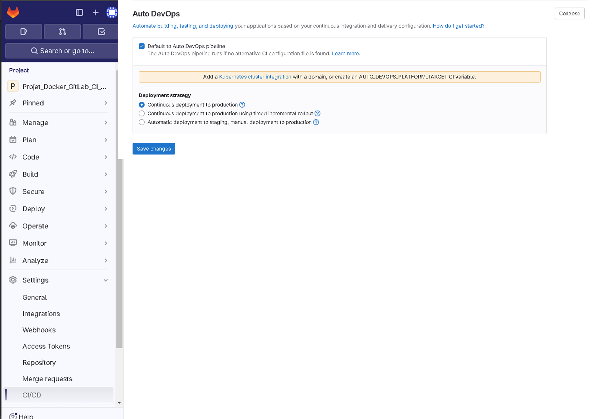

### 2.1.3 ------ Personnaliser le .gitlab-ci.yml pour l'application web statique

Après avoir créer le fichier **.gitlab-ci.yml** à la racine du projet j'ai inclus le modèle Auto-DevOps.gitlab-ci.yml dans mon fichier .gitlab-ci.yml. Cela signifie que j'utilise les configurations prédéfinies de GitLab Auto-DevOps pour automatiser les étapes de builds et de test.

Le modèle **Auto-DevOps de GitLab** se concentre principalement sur l'automatisation des étapes de builds et de test, en laissant une plus grande flexibilité aux développeurs en ce qui concerne le déploiement. Après avoir fais un push du fichier ci-dessous :

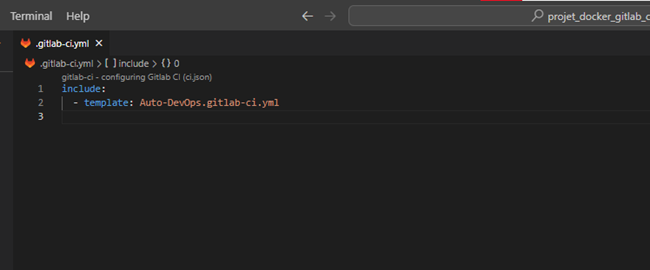

Nous avons la pipeline qui s'est déclenché et qui échoue. Résultat **_ci-dessous_** :

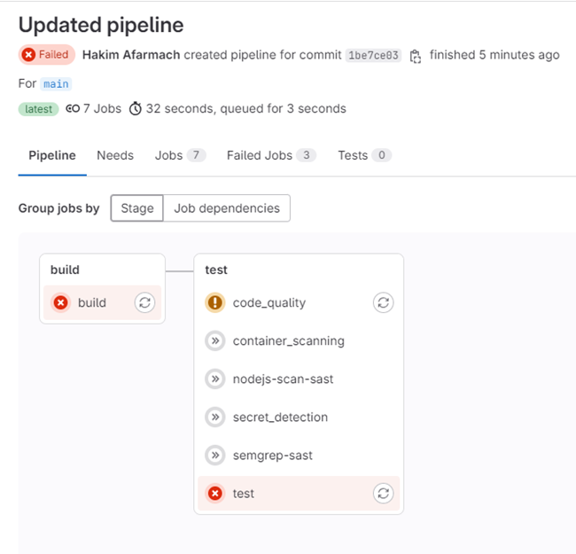

Pour le stage build voici l'erreur que je rencontre :

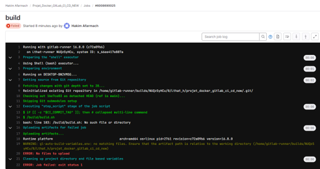

L'erreur que je rencontre, **"bash: line 183: /build/build.sh: No such file or directory"**, indique que le script build.sh n'est pas trouvé dans le chemin spécifié. Après plusieurs tentatives de débuggage et mes recherches sur Internet pour l'étape du build je le ferai d'une manière personnalisé et non en suivant le modèle d'Auto-DevOps.

- **Etape débuggage**

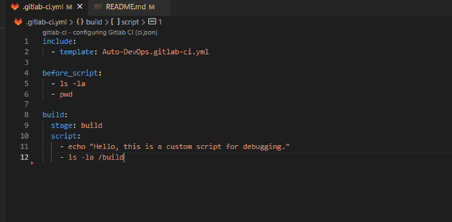

Ces commandes ajoutées nous permettront de vérifier si le fichier build.sh existe dans le répertoire /build pendant l'exécution du pipeline Auto-DevOps. Mais nous avons toujours la même erreur, alors j'ai abandonné pour le modèle d'Auto-DevOps pour le premier stage.

Pour le second stage (test) la partie **_code_quality_** j'ai eu cette erreur de permissions.

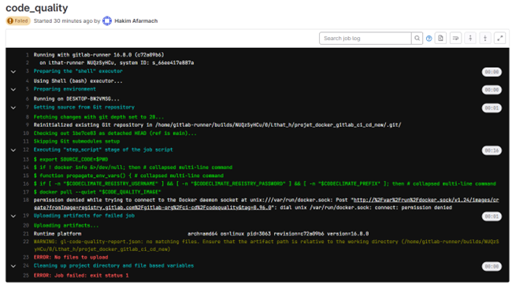

Alors en tapant dans ma distribution ubuntu **groups gitlab-runner** j'ai vu qu'il y a un problème d'accès au socker Docker car le démon Docker écoute par défaut sur le socket Unix /var/run/docker.sock. L'accès à ce socket est contrôlé par les permissions de fichier et l'appartenance au groupe docker. Or en ajoutant gitlab-runner au groupe docker, je pourrai donner à mon Runner local "Shell executor" les droits nécessaires pour communiquer avec le démon Docker.

Voici les commandes à taper en tant que root et relancer la pipeline depuis l'interface Gitlab :

                          - usermod -aG docker gitlab-runner
                          - chown gitlab-runner:gitlab-runner gitlab-runner.service
                          - gitlab-runner restart

Après avoir relancé la pipeline nous pouvons voir que l'erreur s'est corrigée.

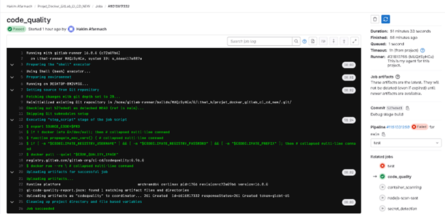

On peut voir que le Job a duré 51 minutes et 33 secondes car mon pc était entrain de pull toutes les images nécessaires etn'a pas assez de ressources. ( n'est pas assez puissant )

**Personnalisation du gitlab-ci.yml**

Après analyse du modèle auto-devops nous allons inclure seulement le job **_Code-quality_** pour le stage **test**, pour le build nous le ferons sans modèle et pour le déploiement en staging via la variable d'environnement **_STAGING_ENABLED_** AutoDevOps se chargera de déployer automatiquement l'application en staging.

### 2.1.4 ------ Déployer l'application dans un environnement de staging

Voici à quoi ressemble ma pipeline finale

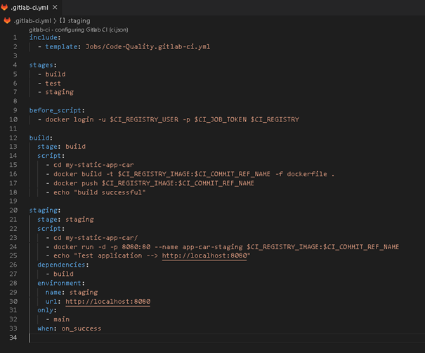

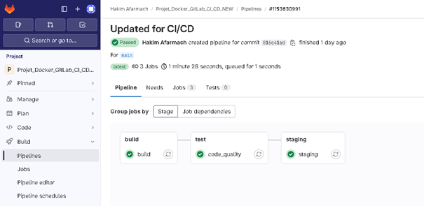

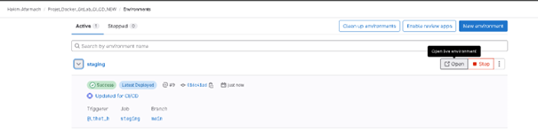


### 2.1.5 ------ Documenter le processus AutoDevOps et les choix de configuration

**Explication de la pipeline**

```sh
Include:
  -template: Jobs/Code-Quality.gitlab-ci.yml
```

                    - On inclus le modèle du stage Test qui a pour job Code-Quality

```sh
Stages:
    -build
    -test
    -staging
```

                    - On déclare les stages ( étapes de la pipeline)

```sh
before_script:
    - docker login -u $CI_REGISTRY_USER -p $CI_JOB_TOKEN $CI_REGISTRY
```

                    - On se connecte au registre Docker en utilisant les informations d'identification du projet (nom d'utilisateur et token) afin de préparer l'environnement Docker pour l'exécution des tâches du pipeline.

```sh
build:
  stage: build
  script:
    - cd my-static-app-car
    - docker build -t $CI_REGISTRY_IMAGE:$CI_COMMIT_REF_NAME -f dockerfile .
    - docker push $CI_REGISTRY_IMAGE:$CI_COMMIT_REF_NAME
    - echo "build successful"**
```

                    - On définit la tâche de construction ("build") dans la phase "build" du pipeline. Il se déplace vers le répertoire "my-static-app-car", construit une image Docker à partir du fichier Dockerfile, pousse cette image vers le registre Docker associé au projet, et affiche un message indiquant que la construction a réussi. l'image sera le l'adresse du registre Docker associé à mon projet + le tag qui est le nom de la branche soit **main**

```sh
staging:
  stage: staging
  script:
    - cd my-static-app-car/
    - docker run -d -p 8080:80 --name app-car-staging  $CI_REGISTRY_IMAGE:$CI_COMMIT_REF_NAME
    - echo "Test application --> http://localhost:8080"
  dependencies:
    - build
  environment:
    name: staging
    url: http://localhost:8080
  only:
    - main
  when: on_success

```

                  - C'est le job de déploiement sur un environnement de staging (pré-production).La tâche "staging" dans la phase "staging" du pipeline CD déploie l'application statique (my-static-app-car) en utilisant une image Docker construite précédemment sur le registre Docker du projet. Elle lance un conteneur Docker en mode détaché (-d), exposant le port 8080 localement et utilisant l'étiquette d'image correspondant à la branche principale ($CI_COMMIT_REF_NAME). Ensuite, un message est affiché indiquant l'URL à laquelle l'application peut être testée en environnement de staging. Cette tâche dépend de la tâche de construction ("build"), est conditionnée pour s'exécuter uniquement sur la branche principale (main), et est déclenchée en cas de succès du pipeline de construction. L'environnement de staging est configuré avec le nom "staging" et l'URL http://localhost:8080.

**Processus AutoDevOps**

Comme je l'ai déjà expliquer pour le processus AutoDevOps après une grande analyse le job qu'on peut utilisé adéquatement au projet est le job Code-Quality.

Voici le lien de la pipeline réussi [ICI](https://gitlab.com/Lthat_h/projet_docker_gitlab_ci_cd_new/-/commit/016c41ad32a07da433d37e05824abe2c135f0c24/pipelines)

## 2.2 --- Exercice 2 : Déploiement en Staging et Production

### 2.2.1 ------ Pré-requis

                        - Avoir un RUNNER local
                        - Editeur de code (Vscode, SublimText, Notepad++)
                        - Avoir fini l'exo 1 Partie 2

### 2.2.2 ------ Compléter le .gitlab-ci.yml pour inclure des stages de déploiement distincts pour le staging et la production

Voici la pipeline et les résultats

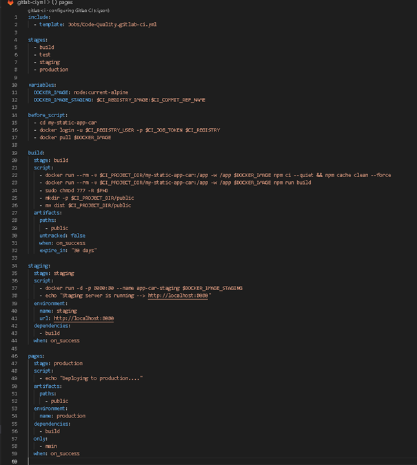

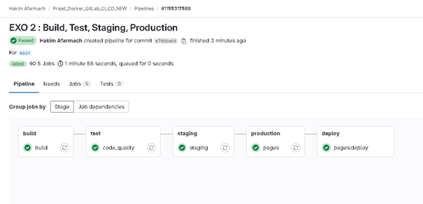

Voici le lien de la pipeline réussi [ICI](https://gitlab.com/Lthat_h/projet_docker_gitlab_ci_cd_new/-/pipelines/1155317588)

### 2.2.3 ------ Configurer le déploiement automatique sur GitLab Pages pour la production

J'ai suivi le mode opératoire directement sur gitlab pour voir comment construite et compléter ma pipeline sans validé j'ai récupérer juste le draft et adapté à ma pipeline.

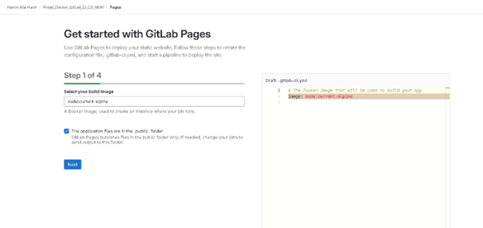

### 2.2.4 ------ Vérifier le fonctionnement de l'application dans les deux environnements

Le fonctionnement de l'application dans l'environnement **staging** et de **prod** fonctionne correctement. Vous trouverez ci-dessous les explications de ma pipeline en détails pour comprendre.

### 2.2.5 ------ Documenter les étapes et configurations pour les déploiements en staging et en production

```sh
Include:
  -template: Jobs/Code-Quality.gitlab-ci.yml
```

                    - On inclus le modèle du stage Test qui a pour job Code-Quality

```sh
Stages:
    -build
    -test
    -staging
    -production

```

                    - On déclare les stages ( étapes de la pipeline)

```sh
variables:
  DOCKER_IMAGE: node:current-alpine
  DOCKER_IMAGE_STAGING: $CI_REGISTRY_IMAGE:$CI_COMMIT_REF_NAME
```

                    - On déclare nos variables, la variable DOCKER_IMAGE qui va nous servir pour le BUILD
                      et le DOCKER_IMAGE_STAGING pour le staging

```sh
before_script:
  - cd my-static-app-car
  - docker login -u $CI_REGISTRY_USER -p $CI_JOB_TOKEN $CI_REGISTRY
  - docker pull $DOCKER_IMAGE
```

                    - On se déplace dans le répertoire my-static-app-car ensuite on se login comme annoncé dans l'exo 1 et on pull l'image docker pour pouvoir exécuter nos conteneur et nos scripts de builds

```sh
build:
  stage: build
  script:
    - docker run --rm -v $CI_PROJECT_DIR/my-static-app-car:/app -w /app $DOCKER_IMAGE npm ci --quiet && npm cache clean --force
    - docker run --rm -v $CI_PROJECT_DIR/my-static-app-car:/app -w /app $DOCKER_IMAGE npm run build
    - sudo chmod 777 -R $PWD
    - mkdir -p $CI_PROJECT_DIR/public
    - mv dist $CI_PROJECT_DIR/public
  artifacts:
    paths:
      - public
    untracked: false
    when: on_success
    expire_in: "30 days"

```

                  - Suite à plusieurs problème de mon runner avec des versions node pas compatibles et des permissions denied j'ai réfléchis à une solution docker qui exécutera un conteneur avec un volume associé à mon runner ou je pourrai build dans le conteneur docker grace à l'image adapté et déclarer qui utilise un node:current-alpine tout en récupérant les résultats dans mon runner ensuite une fois que le conteneur fini ses script il se supprime automatiquement pareil pour le second qui effectue le npm run build ensuite pou résoudre les problèmes de permissions denied j'ai modifié les permissions des fichiers pour les rendre accessibles (chmod 777) dans le répertoire de travail actuel ($PWD), créé un répertoire public dans le répertoire du projet GitLab ($CI_PROJECT_DIR).
                   Déplace le contenu du répertoire dist généré par la construction de l'application vers le répertoire public. Et ensuite configurer les artifacts,.Ces artefacts peuvent être utilisés dans les étapes suivantes du pipeline ou pour le déploiement. Ils sont conservés pendant une période de 30 jours après le succès de la tâche de construction.
                   En résumé, ce script automatise le processus de construction de l'application statique en utilisant Docker, installe les dépendances, construit l'application, ajuste les permissions des fichiers, déplace les fichiers construits vers un répertoire public, et configure les artefacts pour une utilisation ultérieure dans le pipeline GitLab CI.

```sh
staging:
  stage: staging
  script:
    - docker run -d -p 8080:80 --name app-car-staging $DOCKER_IMAGE_STAGING
    - echo "Staging server is running --> http://localhost:8080"
  environment:
    name: staging
    url: http://localhost:8080
  dependencies:
    - build
  when: on_success


```

                  - Pour le staging c'est celui qui est identique à l'exo 1 et en cas de succès s'exécute automatiquement dans son environnement

```sh
pages:
  stage: production
  script:
    - echo "Deploying to production...."
  artifacts:
    paths:
      - public
  environment:
    name: production
  dependencies:
    - build
  only:
    - main
  when: on_success


```

                - Ce job de production ne contient pas d'étapes de déploiement spécifiques dans le script, mais il configure l'environnement de production dans GitLab et prépare les artefacts nécessaires pour le déploiement ( récupérer à partir du build ). Entre autre ce job spécifie que cette tâche dépend de la tâche "build", ce qui signifie qu'elle ne sera exécutée que si la tâche "build" associée a réussi. La tâche est configurée pour s'exécuter uniquement lorsque la construction est réussie et que le pipeline est exécuté sur la branche principale ("only: - main", "when: on_success").

## 2.3 --- Exercice 3 : Vulnérabilités

### 2.3.1 ------ Pré-requis

                        - Avoir un RUNNER local
                        - Editeur de code (Vscode, SublimText, Notepad++)
                        - Avoir fini l'exo 1 Partie 2 et l'exo 2

### 2.3.2 ------- Pipeline EXO 3 + Explications et résultat final

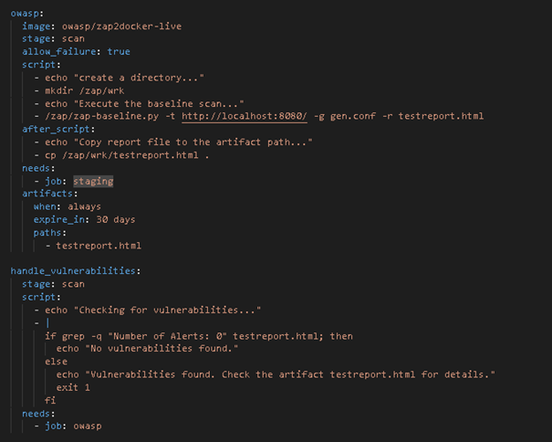

```sh
owasp:
  image: owasp/zap2docker-live
  stage: scan
  allow_failure: true
  script:
    - echo "Création d'un répertoire..."
    - mkdir /zap/wrk
    - echo "Exécution du scan de base..."
    - /zap/zap-baseline.py -t http://localhost:8080/ -g gen.conf -r testreport.html
  after_script:
    - echo "Copie du fichier de rapport vers le chemin des artefacts..."
    - cp /zap/wrk/testreport.html .
  needs:
    - job: staging
  artifacts:
    when: always
    expire_in: 30 days
    paths:
      - testreport.html

handle_vulnerabilities:
  stage: scan
  script:
    - echo "Vérification des vulnérabilités dans le rapport..."
    - |
      if grep -q "Number of Alerts: 0" testreport.html; then
        echo "Aucune vulnérabilité détectée."
      else
        echo "Vulnérabilités détectées. Consultez le rapport testreport.html pour plus de détails."
        exit 1
      fi
  needs:
    - job: owasp

```

                        - Dans ce job La première étape (owasp) utilise l'image Docker de OWASP ZAP pour effectuer un scan de sécurité sur http://localhost:8080/ notre url STAGING, génère un rapport (testreport.html), et copie ce rapport dans les artefacts du pipeline.

                        La deuxième étape (handle_vulnerabilities) vérifie le rapport pour la présence de vulnérabilités. Si aucune vulnérabilité n'est détectée, elle affiche un message indiquant l'absence de vulnérabilités. Sinon, elle signale la présence de vulnérabilités et termine le pipeline avec un code d'erreur. Cette étape dépend du succès de l'étape précédente (owasp).

Merci

voici la pipeline [ICI](https://gitlab.com/Lthat_h/projet_docker_gitlab_ci_cd_new/-/jobs/6038726114)

-------------------------------**FIN**--------------------------------
